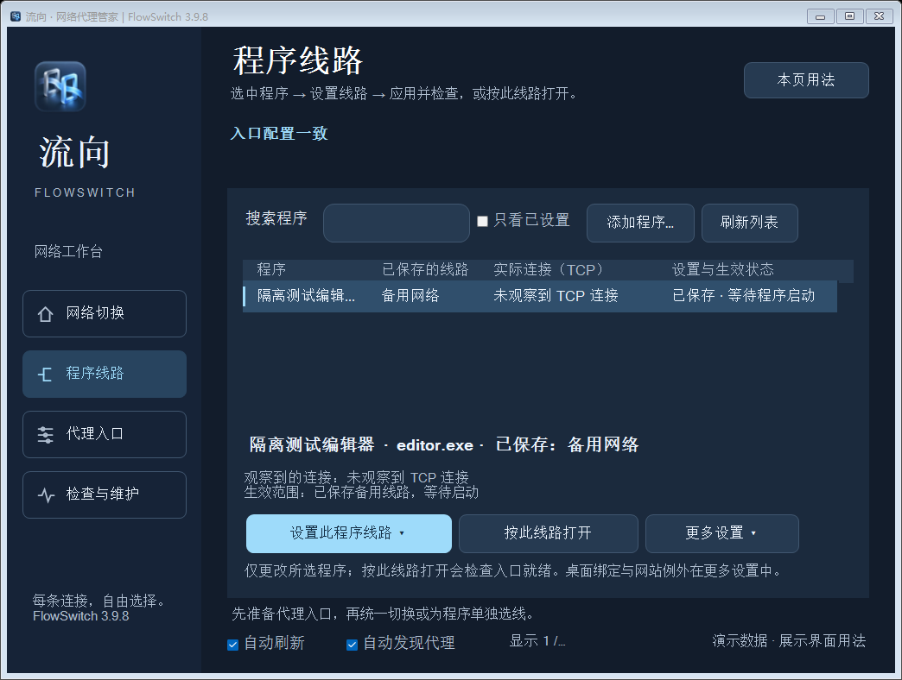
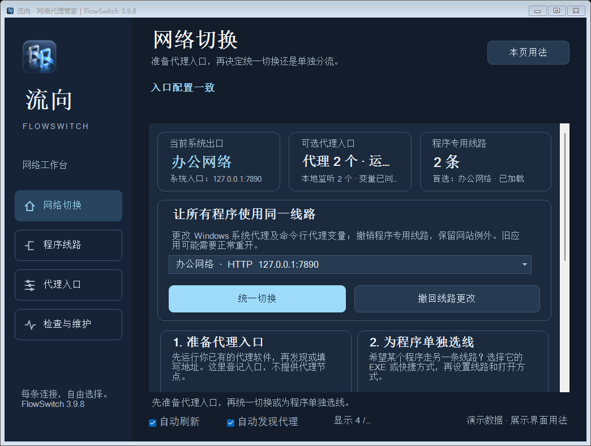
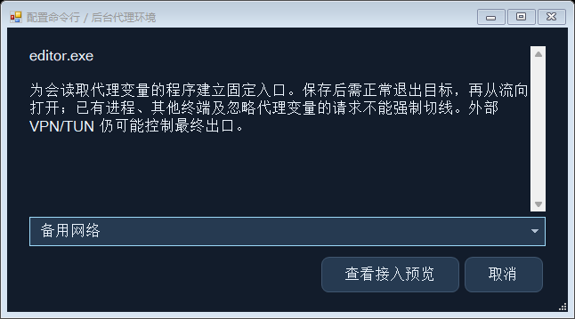

# 3.9.8 隔离 Demo 素材

直接复用 2026-10-02 保存的 Test-UsabilityUI 控件捕获，没有重新运行应用或图像生成。

| 文件 | 原捕获名 | 场景 |
| --- | --- | --- |
| programs-demo.png | UI-last-fallback/programs-selected-wide-1.25.png | 程序列表、选中详情和主要动作 |
| network-demo.png | UI-last-fallback/home-wide-1.25.png | 网络切换、任务卡和演示入口 |
| environment-demo.png | UI-last-fallback/environment-settings-1.25.png | 可选环境适配说明与预览 |

**公开说明：3.9.8 冻结源码对应隔离 Demo，1.25 倍布局模拟与备用字体，非实机连接结果。** 主窗口/主题摘要同固定源码一致；日志摘要取于受控字体替换和测试注入之前，不得称未经修改的最终 EXE 实机验收。样例程序、路径和线路不含用户登录或现场进程列表。

品牌沿用 [FlowSwitch.png](../FlowSwitch.png) / [FlowSwitch.ico](../FlowSwitch.ico)，来源见 [BRAND.md](../BRAND.md)。品牌图不代表功能验收；上级 screenshot/program-menu/proxy-management 是 3.8.4 历史 Demo。
